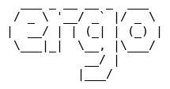

Ergo (formerly known as Oragono) is a modern IRC server written in Go. Its core design principles are:

* Being simple to set up and use
* Combining the features of an ircd, a services framework, and a bouncer (integrated account management, history storage, and bouncer functionality)
* Bleeding-edge [IRCv3 support](https://ircv3.net/software/servers.html), suitable for use as an IRCv3 reference implementation
* High customizability via a rehashable (i.e., reloadable at runtime) YAML config

Ergo is a fork of the [Ergonomadic](https://github.com/jlatt/ergonomadic) IRC daemon <3

---

[](https://goreportcard.com/report/github.com/ergochat/ergo)
[](https://github.com/ergochat/ergo/actions/workflows/build.yml)
[](https://github.com/ergochat/ergo/releases/latest)
[](https://crowdin.com/project/ergochat)

If you want to take a look at a running Ergo instance or test some client code, feel free to play with [testnet.ergo.chat](https://testnet.ergo.chat/) (TLS on port 6697 or plaintext on port 6667).

---


## Features

* integrated services: NickServ for user accounts, ChanServ for channel registration, and HostServ for vanity hosts
* bouncer-like features: storing and replaying history, allowing multiple clients to use the same nickname
* UTF-8 nick and channel names with rfc7613 (PRECIS)
* native TLS/SSL support, including support for client certificates
* [yaml](https://yaml.org/) configuration
* updating server config and TLS certificates on-the-fly (rehashing)
* SASL authentication
* [LDAP support](https://github.com/ergochat/ergo-ldap)
* supports [multiple languages](https://crowdin.com/project/ergochat) (you can also set a default language for your network)
* advanced security and privacy features (support for requiring SASL for all logins, cloaking IPs, and running as a Tor hidden service)
* an extensible privilege system for IRC operators
* ident lookups for usernames
* automated client connection limits
* passwords stored with [bcrypt](https://godoc.org/golang.org/x/crypto)
* `UBAN`, a unified ban system that can target IPs, networks, masks, and registered accounts (`KLINE` and `DLINE` are also supported)
* [IRCv3 support](https://ircv3.net/software/servers.html)
* a focus on developing with [specifications](https://ergo.chat/specs.html)

For more detailed information on Ergo's functionality, see:

* [MANUAL.md, the operator manual](https://github.com/ergochat/ergo/blob/stable/docs/MANUAL.md)
* [USERGUIDE.md, the guide for end users](https://github.com/ergochat/ergo/blob/stable/docs/USERGUIDE.md)

## Quick start guide

Download the latest release from this page: https://github.com/ergochat/ergo/releases/latest

Extract it into a folder, then run the following commands:

```sh
cp default.yaml ircd.yaml
vim ircd.yaml   # modify the config file to your liking
ergo mkcerts
ergo run     # server should be ready to go!
```

**Note:** See the [productionizing guide in our manual](https://github.com/ergochat/ergo/blob/stable/docs/MANUAL.md#productionizing-with-systemd) for recommendations on how to run a production network, including obtaining valid TLS certificates.

### Platform Packages

Some platforms/distros also have Ergo packages maintained for them:

* Arch Linux [AUR](https://aur.archlinux.org/packages/ergochat/) - Maintained by [Jason Papakostas (@vith)](https://github.com/vith).
* [Gentoo Linux](https://packages.gentoo.org/packages/net-irc/ergo) - Maintained by [Sam James (@thesamesam)](https://github.com/thesamesam).

### Using Docker

A Dockerfile and example docker-compose recipe are available in the `distrib/docker` directory. Ergo is automatically published
to Docker Hub at [ergochat/ergo](https://hub.docker.com/r/ergochat/ergo). For more information, see the distrib/docker
[README file](https://github.com/ergochat/ergo/blob/master/distrib/docker/README.md).

### From Source

You can also clone this repository and build from source. Typical deployments should use the `stable` branch, which points to the latest stable release. In general, `stable` should coincide with the latest published tag that is not designated as a beta or release candidate (for example, `v2.7.0-rc1` was an unstable release candidate and `v2.7.0` was the corresponding stable release), so you can also identify the latest stable release tag on the [releases page](https://github.com/ergochat/ergo/releases) and build that.

The `master` branch is not recommended for production use since it may contain bugs, and because the forwards compatibility guarantees for the config file and the database that apply to releases do not apply to master. That is to say, running master may result in changes to your database that end up being incompatible with future versions of Ergo.

For information on contributing to Ergo, see [DEVELOPING.md](https://github.com/ergochat/ergo/blob/master/DEVELOPING.md).

#### Building

You'll need an [up-to-date distribution of the Go language for your OS and architecture](https://golang.org/dl/). Once that's installed (check the output of `go version`), just check out your desired branch or tag and run `make build`. This will produce an executable binary named `ergo` in the base directory of the project. (Ergo vendors all its dependencies, so you will not need to fetch any dependencies remotely.)

## Configuration

The default config file [`default.yaml`](default.yaml) helps walk you through what each option means and changes.

You can use the `--conf` parameter when launching Ergo to control where it looks for the config file. For instance: `ergo run --conf /path/to/ircd.yaml`. The configuration file also stores where the log, database, certificate, and other files are opened. Normally, all these files use relative paths, but you can change them to be absolute (such as `/var/log/ircd.log`) when running Ergo as a service.

### Logs

By default, logs go to stderr only. They can be configured to go to a file, or you can use systemd to direct the stderr to the system journal (see the manual for details). The configuration format of logs is designed to be easily pluggable, and is inspired by the logging config provided by InspIRCd.

### Passwords

Passwords (for both `PASS` and oper logins) are stored using bcrypt. To generate encrypted strings for use in the config, use the `genpasswd` subcommand as such:

```sh
ergo genpasswd
```

With this, you receive a blob of text which you can plug into your configuration file.

### Nickname and channel registration

Ergo relies heavily on user accounts to enable its distinctive features (such as allowing multiple clients per nickname). As a user, you can register your current nickname as an account using `/msg NickServ register <password>`. Once you have done so, you should [enable SASL in your clients](https://libera.chat/guides/sasl), ensuring that you will be automatically logged into your account on each connection. This will prevent [problems claiming your registered nickname](https://github.com/ergochat/ergo/blob/master/docs/MANUAL.md#nick-equals-account).

Once you have registered your nickname, you can use it to register channels:

1. Join the channel with `/join #channel`
2. Register the channel with `/CS REGISTER #channel`

After this, your channel will remember the fact that you're the owner, the topic, and any modes set on it!


# Credits

* Jeremy Latt (2012-2014)
* Edmund Huber (2014-2015)
* Daniel Oaks (2016-present)
* Shivaram Lingamneni (2017-present)
* [Many other contributors and friends of the project <3](https://github.com/ergochat/ergo/blob/master/CHANGELOG.md)
